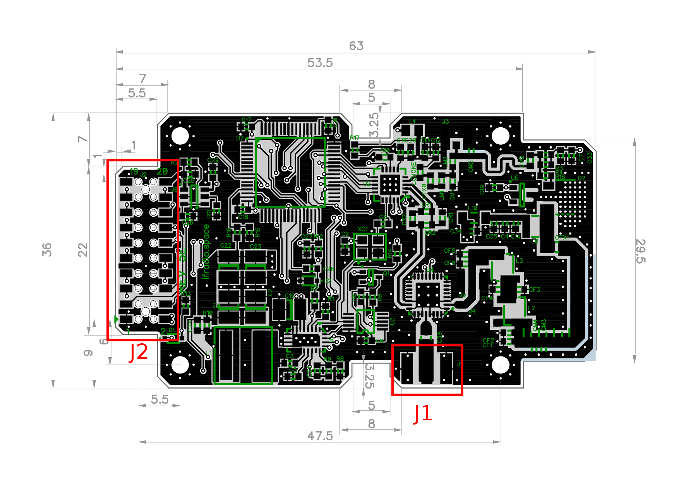

Connectors and Pinout
========================================

J1 - ANT SMA Connector
----------------------------------------
J1 is a 50 ohm female SMA connector for the antenna. It acts as both the
transmit and receive connection via an integrated RF switch. J1 is an edge mount
connector mounted parallel to the board.

J2 - Main Header Connector
----------------------------------------
J2 is a female low profile 2 mm header (Sullins NPPN102GFNP-RC) that can be mated to
from either the top or the bottom.  Compatible mating connectors depend on how
LFR is mounted; Samtec MTMM-110-07-G-D-290 works for a good range of configurations.

+-----+------------------+------------------+-----+
| Pin | Description      | Description      | Pin |
+=====+==================+==================+=====+
| 19  | Ground           | 3V3 In           | 20  |
+-----+------------------+------------------+-----+
| 17  | Debug UART TXD   | Debug UART RXD   | 18  |
+-----+------------------+------------------+-----+
| 15  | External SDA     | External SCL     | 16  |
+-----+------------------+------------------+-----+
| 13  | Radio GPIO2      | Radio GPIO3      | 14  |
+-----+------------------+------------------+-----+
| 11  | Radio GPIO0      | Radio GPIO1      | 12  |
+-----+------------------+------------------+-----+
| 9   | MSP430 SBWTCK    | MSP430 SBWTDIO   | 10  |
+-----+------------------+------------------+-----+
| 7   | MSP430 GPIO P2.3 | MSP430 GPIO P2.4 | 8   |
+-----+------------------+------------------+-----+
| 5   | TX Inhibit       | TX Active        | 6   |
+-----+------------------+------------------+-----+
| 3   | CMD UART TXD     | CMD UART RXD     | 4   |
+-----+------------------+------------------+-----+
| 1   | Ground           | VBATT In         | 2   |
+-----+------------------+------------------+-----+

TPx - Test Points
---------------------------------------
The board also features test points that can be used to debug communications
between the MCU and RFIC. They are aligned to a 100 mil (2.54 mm) grid and are
designed to mate with pogo pins.

+---+-------------------------------------+
|TP | Description                         |
+===+=====================================+
| 1 | Si4464 Interrupt Request            |
+---+-------------------------------------+
| 2 | Si4464 SPI Clock                    |
+---+-------------------------------------+
| 3 | Si4464 SPI MISO                     |
+---+-------------------------------------+
| 4 | Si4464 SPI MOSI                     |
+---+-------------------------------------+
| 5 | Si4464 SPI Chip Select (active low) |
+---+-------------------------------------+
| 6 | Si4464 Shutdown                     |
+---+-------------------------------------+
| 7 | PA/TCXO DAC I:sup:`2`C SCL          |
+---+-------------------------------------+
| 8 | PA V:sub:`dd` (divided)             |
+---+-------------------------------------+
| 9 | PA I:sub:`mon` output               |
+---+-------------------------------------+
| 10| PA V:sub:`dd` PGOOD output          |
+---+-------------------------------------+
