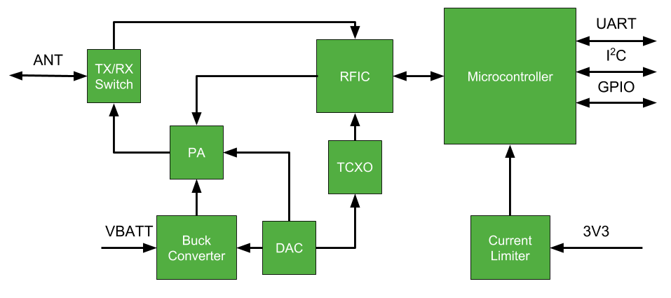

Overview
====================

Little Free Radio (LFR) is open source, command, telemetry, and data radio,
geared at CubeSats, high altitude balloons, and other applications requiring a
small, power efficient, medium-speed communications link. The design is built
around inexpensive commercially available components.

The low power integrated processor, the Texas Instruments
`MSP430FR5994<http://www.ti.com/product/msp430fr5994>`_, manages interfacing
with the RFIC and provides a convenient interface for the flight computer. This
includes an internal packet buffer, storage and configuration of RF parameters,
and control of supporting RF switching and amplifier circuitry.

The RFIC, the Silicon Labs
`Si4464<https://www.silabs.com/products/wireless/proprietary/ezradiopro-ism-band-transmitters-recievers-transceivers/device.si4464>`_,
is a high performance, low power, transceiver IC covering a wide range of
VHF and UHF frequencies.

A TCXO provides an accurate and stable frequency reference across the LFR's
entire operating range.

The power amplifier is a high-efficiency Class-E design based on the
AFT05MS004NT1 MOSFET.  Good efficiency is maintained across a wide range of
output power by adjusting the drain voltage .

Features
--------------------
- 2FSK / 2GFSK / 4FSK\* / 4GFSK\* / CW\* narrow band transceiver
- Data rates up to 1 Mbps (10 kpbs typical)
- Wide frequency range: 119 MHz - 960 MHz\*\*
- High transmit power: > 3W\*\*
- High efficiency PA: > 65% from under 1W to over 3W\*\*
- Open source hardware, firmware, and example SDR ground station
- RF Protocol Support:
  - Low-overhead custom framing with CRC-16
  - `CCSDS 133.0-B-1 <https://public.ccsds.org/Pubs/133x0b1c2.pdf>`_\*

- 3.3V logic supply and unregulated 5 to 20V VBATT supply
- Low RX power consumption: < 25 mA @ 3.3 V
- Multiple interface options:
  - UART (9600 / 38400 / 115200 baud)
  - I:sup:`2`C slave\*
  - SPI slave\*

- RF parameters reconfigurable in orbit (within band)\*
- Half duplex with single antenna
- SMA antenna connector
- Hardware TX inhibit
- Hardware AFC\*
- Hardware AGC\*
- Data whitening\*
- Integrated single event latch-up mitigation and over-current protection
- Integrated transmit amplifier buck converter
- Industrial temperature range: -40 to +85 C
- Compact module form factor

.. Why do reStructuedText footnotes not work properly with pandoc?
| \* Exisiting hardware support, software support in progress.
| \*\* Dependent on hardware component selection

Block Diagram
--------------------

